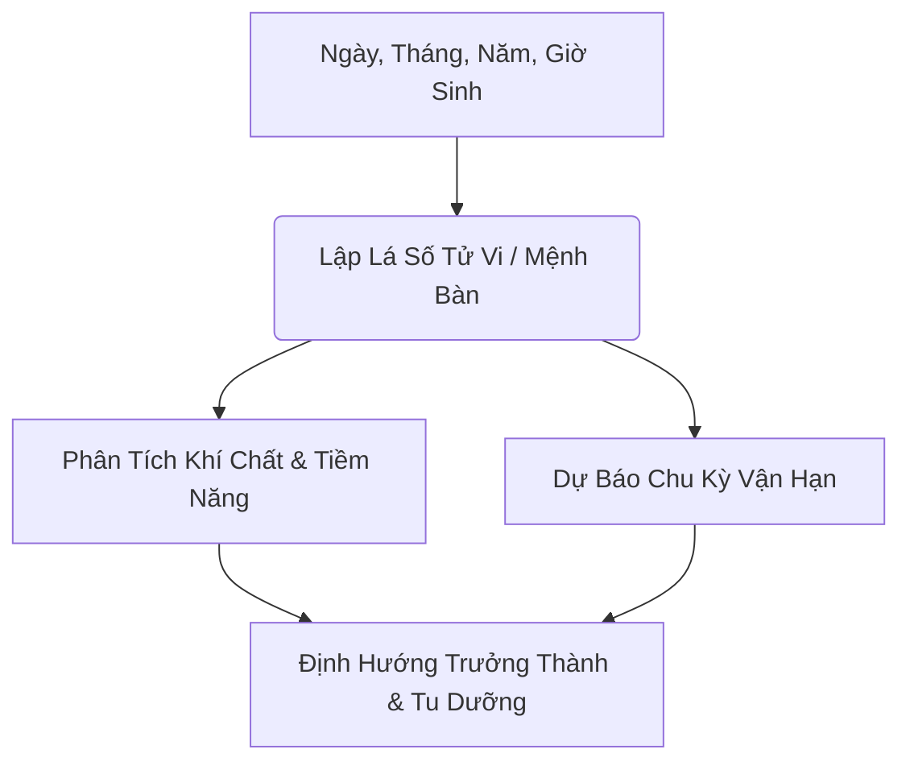
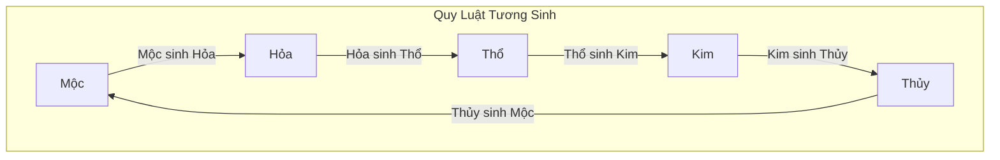
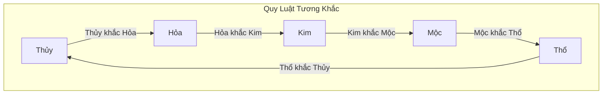
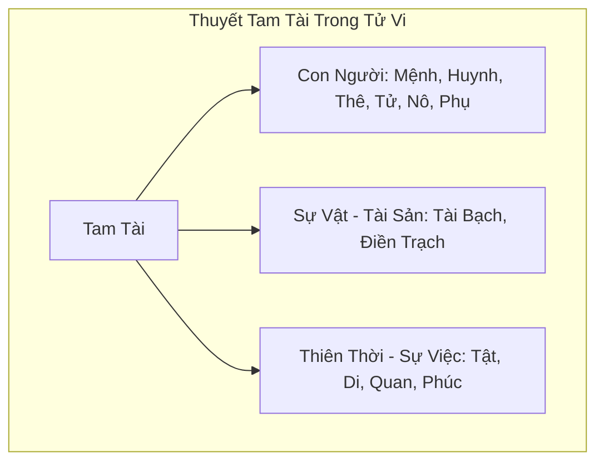
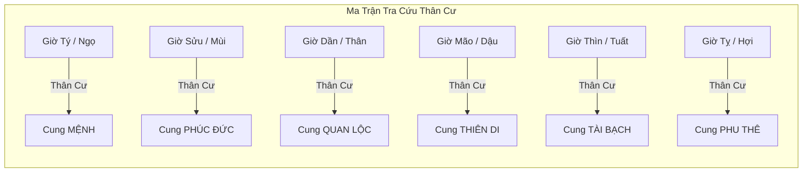
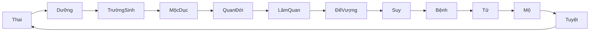
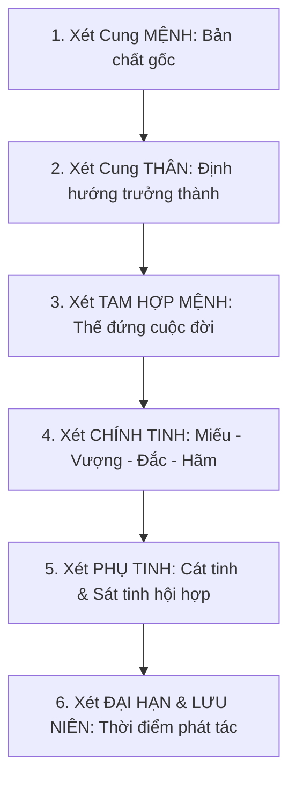

# GIÁO ÁN TỬ VI CĂN BẢN (HOÀN CHỈNH & CHUẨN SƯ PHẠM)

> **Tài liệu nhập môn & nâng cao dành cho người bắt đầu đến thực hành luận giải Tử Vi Đẩu Số.**  
> *Đã được sắp xếp lại theo hệ thống logic khoa học, loại bỏ toàn bộ các đoạn trùng lặp, bổ sung sơ đồ Mermaid trực quan và bảng tra cứu chuẩn.*

---

## 📌 MỤC LỤC TỔNG QUAN

- [CHƯƠNG I: NỀN TẢNG NGUYÊN LÝ DỊCH HỌC & TỬ VI](#chương-i-nền-tảng-nguyên-lý-dịch-học--tử-vi)
  - [1. Tổng Quan Lịch Sử & Mục Đích](#1-tổng-quan-lịch-sử--mục-đích)
  - [2. Thuyết Âm Dương](#2-thuyết-âm-dương)
  - [3. Học Thuyết Ngũ Hành](#3-học-thuyết-ngũ-hành)
  - [4. Thiên Can & Địa Chi (Can Chi)](#4-thiên-can--địa-chi-can-chi)
- [CHƯƠNG II: CẤU TRÚC MỆNH BÀN & 12 CUNG CHỨC NĂNG](#chương-ii-cấu-trúc-mệnh-bàn--12-cung-chức-năng)
  - [1. Khái Niệm Mệnh Bàn & Thuyết Tam Tài](#1-khái-niệm-mệnh-bàn--thuyết-tam-tài)
  - [2. Ý Nghĩa Chi Tiết 12 Cung Chức Năng](#2-ý-nghĩa-chi-tiết-12-cung-chức-năng)
  - [3. Thân Cư & Cách Xác Định 6 Vị Trí Thân Cư](#3-thân-cư--cách-xác-định-6-vị-trí-thân-cư)
  - [4. Vòng Trường Sinh (12 Trạng Thái Phát Triển)](#4-vòng-trường-sinh-12-trạng-thái-phát-triển)
- [CHƯƠNG III: HỆ THỐNG SAO TỬ VI & HÌNH THÁI TƯỚNG MẠO](#chương-iii-hệ-thống-sao-tử-vi--hình-thái-tướng-mạo)
  - [1. Phân Loại Hệ Thống Sao trong Tử Vi](#1-phân-loại-hệ-thống-sao-trong-tử-vi)
  - [2. Tướng Mạo & Thần Thái Ngoại Hình qua 14 Chính Tinh](#2-tướng-mạo--thần-thái-ngoại-hình-qua-14-chính-tinh)
  - [3. Tướng Mạo & Đặc Điểm qua Các Phụ Tinh](#3-tướng-mạo--đặc-điểm-qua-các-phụ-tinh)
- [CHƯƠNG IV: Ý NGHĨA CHI TIẾT CÁC SAO THỦ TẠI 12 CUNG & BỘ SAO ĐẶC BIỆT](#chương-iv-ý-nghĩa-chi-tiết-các-sao-thủ-tại-12-cung--bộ-sao-đặc-biệt)
  - [1. Ý Nghĩa 14 Chính Tinh Thủ Tại 12 Cung](#1-ý-nghĩa-14-chính-tinh-thủ-tại-12-cung)
  - [2. Bộ Tứ Hóa (Lộc - Quyền - Khoa - Kỵ)](#2-bộ-tứ-hóa-lộc---quyền---khoa---kỵ)
  - [3. Bộ Tứ Đức (Thiên Đức, Nguyệt Đức, Long Đức, Phúc Đức)](#3-bộ-tứ-đức-thiên-đức-nguyệt-đức-long-đức-phúc-đức)
  - [4. Bộ Sao Thiên La - Địa Võng](#4-bộ-sao-thiên-la---địa-võng)
  - [5. Bộ Sao Thiên Sứ - Thiên Thương](#5-bộ-sao-thiên-sứ---thiên-thương)
- [CHƯƠNG V: PHƯƠNG PHÁP LUẬN GIẢI LÁ SỐ & VẬN HẠN](#chương-v-phương-pháp-luận-giải-lá-số--vận-hạn)
  - [1. Nguyên Tắc Cốt Lõi Khi Luận Mệnh Bàn](#1-nguyên-tắc-cốt-lõi-khi-luận-mệnh-bàn)
  - [2. 5 Câu Hỏi Lớn Giải Mã Cuộc Đời](#2-5-câu-hỏi-lớn-giải-mã-cuộc-đời)
  - [3. Phương Pháp Xem Đại Hạn & Lưu Niên](#3-phương-pháp-xem-đại-hạn--lưu-niên)
- [CHƯƠNG VI: CÁC CÁCH CỤC PHÚ QUÝ & NGHÈO HỌA TRONG TỬ VI](#chương-vi-các-cách-cục-phú-quý--nghèo-họa-trong-tử-vi)
  - [1. Định Cục Phú Quý & Giàu Có](#1-định-cục-phú-quý--giàu-có)
  - [2. Định Cục Nghèo Khổ, Hung Ác & Hình Thương](#2-định-cục-nghèo-khổ-hung-ác--hình-thương)
  - [3. Tổng Kết & Bài Tập Thực Hành](#3-tổng-kết--bài-tập-thực-hành)

---

## CHƯƠNG I: NỀN TẢNG NGUYÊN LÝ DỊCH HỌC & TỬ VI

### 1. Tổng Quan Lịch Sử & Mục Đích

#### a. Tử Vi Đẩu Số là gì?
- **Tử Vi**: Tên của sao Tử Vi – ngôi sao được xem là **Đế Tinh** (vua của các sao).
- **Đẩu Số**: Phép tính toán định lượng vận mệnh dựa trên tọa độ và tính chất các chòm sao Bắc Đẩu và Nam Đẩu.
- **Định nghĩa**: Tử Vi Đẩu Số là bộ môn dự đoán học phương Đông sử dụng Ngày, Tháng, Năm, Giờ sinh và Giới tính để lập lá số phân tích tiềm năng và vận mệnh con người.

#### b. Nguồn Gốc Lịch Sử
- **Thời kỳ hình thành**: Khoảng thời nhà Tống (Trung Hoa).
- **Thủy tổ**: **Trần Đoàn** (hiệu Hi Di Đạo Sĩ).
- **Nền tảng tổng hợp**:
  - *Kinh Dịch*: Quy luật biến dịch, thời vận, cát hung.
  - *Âm Dương Ngũ Hành*: Sự tương tác và chuyển hóa của khí.
  - *Thiên Văn Học Cổ Đại*: Tọa độ và quy luật chuyển động của các tinh tú.

#### c. Mục Đích Đúng Đắn Khi Học Tử Vi
Tử Vi **không phải** để bói toán mê tín hay cố định 100% số mệnh, mà nhằm:
1. **Hiểu bản thân**: Nhận diện bản chất, tư duy, ưu thế bẩm sinh.
2. **Nắm bắt chu kỳ vận mệnh**: Biết thời điểm nên tiến, nên lùi để gặt hái thành công hoặc hạn chế rủi ro.
3. **Phát huy ưu điểm & Tu dưỡng**: "Mệnh tốt không bằng Hạn tốt, Hạn tốt không bằng Thân tốt, Thân tốt không bằng Tâm tốt".



#### d. Các Trường Phái Tử Vi Chính
| Trường Phái | Đặc Điểm Nổi Bật | Phù Hợp Cho |
| :--- | :--- | :--- |
| **Tử Vi Bắc Phái** | Bám sát sách cổ, chú trọng hệ thống Tứ Hóa, luận theo cung và sao rõ ràng, tính hệ thống cao. | **Người mới bắt đầu** |
| **Tử Vi Nam Phái** | Phát triển mạnh tại Việt Nam, chú trọng kinh nghiệm thực tế, kết hợp yếu tố dân gian & kinh nghiệm truyền miệng. | Thực hành xem lá số Việt Nam |
| **Tử Vi Trung Châu Phái** | Nổi tiếng tại Hồng Kông, phân tích rất sâu về tổ hợp các chòm sao và sự biến hóa của vận hạn. | Nghiên cứu chuyên sâu |
| **Tử Vi Hiện Đại** | Kết hợp tâm lý học hiện đại, nhân tướng học và chiêm tinh phương Tây vào luận giải. | Ứng dụng quản trị & tư vấn tâm lý |

---

### 2. Thuyết Âm Dương

#### a. Khái Niệm Cơ Bản
Thuyết Âm Dương chia vạn vật trong vũ trụ thành hai mặt đối lập nhưng thống nhất: **Âm** và **Dương**.
- **Dương**: Sáng, ở trên, bên ngoài, nóng, chuyển động, mạnh mẽ, chủ động, số lẻ ($1, 3, 5, 7, 9$).
- **Âm**: Tối, ở dưới, bên trong, lạnh, đứng yên, mềm mỏng, bị động, số chẵn ($2, 4, 6, 8, 10$).

#### b. Quy Luật Âm Dương
1. **Đối lập & Thống nhất**: Âm dương là hai mặt của một thể thống nhất. Không có Dương thì không có Âm và ngược lại.
2. **Âm trưởng Dương tiêu, Âm thịnh Dương suy**: Khi mặt này phát triển cực đại thì mặt kia suy giảm và bắt đầu chuyển hóa.
3. **Thuận quy luật thì Hưng, Nghịch quy luật thì Bại**: Mọi sự vật phát triển thuận theo âm dương sẽ đạt trạng thái cân bằng thái hòa.

---

### 3. Học Thuyết Ngũ Hành

#### a. Khái Niệm 5 Yếu Tố Ngũ Hành
Ngũ Hành bao gồm 5 nguyên tố cơ bản cấu thành thế giới vật chất: **Kim, Mộc, Thủy, Hỏa, Thổ**.

| Ngũ Hành | Thuộc Tính Cốt Lõi | Tượng Trưng |
| :--- | :--- | :--- |
| **Kim** | Cương nghị, cải biến, thu hoạch | Kim loại, sự thay đổi, sát phạt |
| **Mộc** | Sinh trưởng, phát triển, ôn hòa | Cây cối, sự sinh sôi, lòng nhân từ |
| **Thủy** | Mềm mại, hướng xuống, linh hoạt | Nước, sự ẩm ướt, trí tuệ |
| **Hỏa** | Nóng nảy, hướng lên, rực rỡ | Lửa, ánh sáng, lễ nghi, đam mê |
| **Thổ** | Nuôi dưỡng, nâng đỡ, trung hậu | Đất đai, sự nâng đỡ, tín nghĩa |

#### b. Quy Luật Tương Sinh & Tương Khắc





- **Nguyên tắc Sinh/Khắc nhập - xuất**:
  - *Sinh nhập* (Sinh ra tôi): Được giúp đỡ, có lợi.
  - *Sinh xuất* (Tôi sinh ra): Phải cống hiến, hao tốn năng lượng.
  - *Khắc nhập* (Khắc tôi): Bị đè nén, kiểm soát, thử thách.
  - *Khắc xuất* (Tôi khắc): Chiếm ưu thế, kiểm soát môi trường.

#### c. Phối Hợp Ngũ Hành với 4 Mùa & Phương Vị
- **Mùa Xuân**: Mộc vượng, Phương Đông.
- **Mùa Hè**: Hỏa vượng, Phương Nam.
- **Mùa Thu**: Kim vượng, Phương Tây.
- **Mùa Đông**: Thủy vượng, Phương Bắc.
- **Tháng cuối 4 mùa (Thìn, Tuất, Sửu, Mùi)**: Thổ vượng, Trung Cung.

#### d. Trạng Thái Vượng Tướng Hưu Tù Tử của Ngũ Hành
1. **Mùa Xuân**: Mộc *Vượng*, Hỏa *Tướng*, Thổ *Tử*, Kim *Tù*, Thủy *Hưu*.
2. **Mùa Hạ**: Hỏa *Vượng*, Thổ *Tướng*, Kim *Tử*, Thủy *Tù*, Mộc *Hưu*.
3. **Mùa Thu**: Kim *Vượng*, Thủy *Tướng*, Mộc *Tử*, Hỏa *Tù*, Thổ *Hưu*.
4. **Mùa Đông**: Thủy *Vượng*, Mộc *Tướng*, Hỏa *Tử*, Thổ *Tù*, Kim *Hưu*.

*Giải nghĩa*:
- **Vượng**: Trạng thái mạnh nhất, thịnh nhất.
- **Tướng**: Trạng thái phát triển sinh sôi mạnh vừa.
- **Hưu**: Trạng thái nghỉ ngơi, thoái trào.
- **Tù**: Trạng thái sa sút, suy giảm.
- **Tử**: Trạng thái hoàn toàn bị khắc chế, suy kiệt.

#### e. Vị Trí Vòng Trường Sinh của Ngũ Hành
- **Mộc**: Trường sinh tại **Hợi**, Đế vượng tại **Mão**, Tử tại **Ngọ**, Mộ tại **Mùi**.
- **Hỏa**: Trường sinh tại **Dần**, Đế vượng tại **Ngọ**, Tử tại **Dậu**, Mộ tại **Tuất**.
- **Kim**: Trường sinh tại **Tỵ**, Đế vượng tại **Dậu**, Tử tại **Tý**, Mộ tại **Sửu**.
- **Thủy & Thổ**: Trường sinh tại **Thân**, Đế vượng tại **Tý**, Tử tại **Mão**, Mộ tại **Thìn**.

---

### 4. Thiên Can & Địa Chi (Can Chi)

Hệ thống Can Chi gồm **10 Thiên Can** và **12 Địa Chi**, phối hợp tạo thành chu kỳ **60 Can Chi** (Lục Thập Hoa Giáp).

#### a. 10 Thiên Can
- **Dương Can**: Giáp, Bính, Mậu, Canh, Nhâm (chỉ số lẻ).
- **Âm Can**: Ất, Đinh, Kỷ, Tân, Quý (chỉ số chẵn).

##### *Thiên Can Hợp Hóa:*
- **Giáp - Kỷ** hợp hóa **Thổ**.
- **Ất - Canh** hợp hóa **Kim**.
- **Bính - Tân** hợp hóa **Thủy**.
- **Đinh - Nhâm** hợp hóa **Mộc**.
- **Mậu - Quý** hợp hóa **Hỏa**.

##### *Thiên Can Xung Xung:*
Giáp Mậu xung, Ất Kỷ xung, Bính Canh xung, Đinh Tân xung, Mậu Nhâm xung, Kỷ Quý xung, Canh Giáp xung, Tân Ất xung, Nhâm Bính xung, Quý Đinh xung.

#### b. 12 Địa Chi
- **Dương Chi**: Tý, Dần, Thìn, Ngọ, Thân, Tuất.
- **Âm Chi**: Sửu, Mão, Tỵ, Mùi, Dậu, Hợi.

##### *Địa Chi Lục Hợp:*
- Tý - Sửu hợp **Thổ** | Dần - Hợi hợp **Mộc**
- Mão - Tuất hợp **Hỏa** | Thìn - Dậu hợp **Kim**
- Tỵ - Thân hợp **Thủy** | Ngọ - Mùi hợp **Thổ**

##### *Địa Chi Lục Xung (Tương Xung Trực Diện):*
- **Tý - Ngọ** tương xung | **Mão - Dậu** tương xung
- **Dần - Thân** tương xung | **Tỵ - Hợi** tương xung
- **Thìn - Tuất** tương xung | **Sửu - Mùi** tương xung

##### *Địa Chi Tam Hợp Cục:*
- **Thân - Tý - Thìn**: Khởi Thủy Cục (Trường sinh ở Thân, Vượng ở Tý, Mộ ở Thìn).
- **Hợi - Mão - Mùi**: Khởi Mộc Cục (Trường sinh ở Hợi, Vượng ở Mão, Mộ ở Mùi).
- **Dần - Ngọ - Tuất**: Khởi Hỏa Cục (Trường sinh ở Dần, Vượng ở Ngọ, Mộ ở Tuất).
- **Tỵ - Dậu - Sửu**: Khởi Kim Cục (Trường sinh ở Tỵ, Vượng ở Dậu, Mộ ở Sửu).

##### *Địa Chi Tương Hại:*
Tý - Mùi hại, Sửu - Ngọ hại, Dần - Tỵ hại, Mão - Thìn hại, Thân - Hợi hại, Dậu - Tuất hại.

##### *Địa Chi Tương Hình:*
- **Tam hình**: Dần hình Tỵ, Tỵ hình Thân, Thân hình Dần (Hình vô ân); Sửu hình Tuất, Tuất hình Mùi, Mùi hình Sửu (Hình ỷ thế).
- **Tương hình**: Tý hình Mão, Mão hình Tý (Hình vô lễ).
- **Tự hình**: Thìn, Ngọ, Dậu, Hợi tự hình lẫn nhau.

---

## CHƯƠNG II: CẤU TRÚC MỆNH BÀN & 12 CUNG CHỨC NĂNG

### 1. Khái Niệm Mệnh Bàn & Thuyết Tam Tài

Mệnh Bàn là toàn bộ lá số Tử Vi được lập từ: **Giờ sinh, Ngày sinh, Tháng sinh, Năm sinh và Giới tính**. Mệnh Bàn chính là "bản thiết kế cuộc đời".

#### Thuyết Tam Tài trong Mệnh Bàn (Thiên - Địa - Nhân)
- **Thiên Thời / Sự Việc**: Cung Tật Ách, Cung Thiên Di, Cung Quan Lộc, Cung Phúc Đức.
- **Địa Lợi / Sự Vật (Kho Tiền & Tài Sản)**: Cung Tài Bạch, Cung Điền Trạch.
- **Nhân Hòa / Con Người**: Cung Mệnh, Cung Huynh Đệ, Cung Phu Thê, Cung Tử Tức, Cung Nô Bộc, Cung Phụ Mẫu.



---

### 2. Ý Nghĩa Chi Tiết 12 Cung Chức Năng

Sơ đồ không gian lá số 12 Cung trên Mệnh Bàn Tử Vi:

```
+------------------+------------------+------------------+------------------+
| Cung TỴ           | Cung NGỌ         | Cung MÙI         | Cung THÂN        |
+------------------+------------------+------------------+------------------+
| Cung THÌN        |                  |                  | Cung DẬU         |
+------------------|   TỬ VI ĐẨU SỐ   |------------------+
| Cung MÃO         |    MỆNH BÀN     |                  | Cung TUẤT        |
+------------------+------------------+------------------+------------------+
| Cung DẦN         | Cung SỬU         | Cung TÝ          | Cung HỢI         |
+------------------+------------------+------------------+------------------+
```

#### 1. Cung Mệnh (Bản Thân Trọng Tâm)
- Là trung tâm thần trí của toàn bộ lá số.
- Cho biết: Khí chất bẩm sinh, tính cách, diện mạo, tư duy, tài năng và tổng quan thành bại một đời.
- Luôn phải lấy cung Mệnh làm gốc kết hợp với **Tam Phương Tứ Chính** (Mệnh - Tài - Quan - Di).

#### 2. Cung Huynh Đệ (Anh Chị Em & Mối Quan Hệ Thân Thiết)
- Cho biết số lượng, tính tình, thành tựu của anh chị em ruột thịt.
- Mức độ hòa hợp, giúp đỡ lẫn nhau giữa mệnh chủ với anh em và bạn bè nối phiệt.
- Phối hợp với Cung Phụ Mẫu để nhìn nhận về cha mẹ.

#### 3. Cung Phu Thê (Hôn Nhân & Người Phối Ngẫu)
- Cho biết diện mạo, tính cách, bối cảnh gia thế và thành tựu của người bạn đời (vợ/chồng).
- Duyên phận tình yêu, thái độ ứng xử đối với hôn nhân.
- Muốn xem sâu về vợ/chồng cần nhìn kết hợp sang **Cung Phúc Đức** và **Cung Phụ Mẫu**.

#### 4. Cung Tử Tức (Con Cái & Sản Phẩm Đời Người)
- Số lượng con cái, diện mạo, tính cách, mức độ hiếu thảo và thành tựu của con cái.
- Khả năng sinh sản, sức khỏe cơ quan sinh dục.
- Là sản phẩm kết tinh của quá trình vận hành cuộc sống của mệnh chủ.

#### 5. Cung Tài Bạch (Tài Chính & Năng Lực Kiếm Tiền)
- Năng lực quản lý tài chính, phương thức kiếm tiền (con đường chính ngạch hay hoạch tài giàu nhanh).
- Xu hướng tiêu tiền, khuynh hướng đầu tư và mức độ hưởng thụ vật chất.

#### 6. Cung Tật Ách (Sức Khỏe, Bệnh Tật & Nội Tâm)
- Phản ánh thể trạng sức khỏe, bộ phận yếu nhất trong cơ thể, nguy cơ tai nạn hay tật bệnh nguy hiểm.
- Đồng thời phản ánh **thế giới nội tâm sâu kín** của con người khi không bộc lộ ra ngoài.

#### 7. Cung Thiên Di (Môi Trường Xã Hội & Ngoại Giao)
- Đối chiếu trực diện với Cung Mệnh (Mệnh là bên trong, Di là bên ngoài).
- Cho biết khả năng thích ứng hoàn cảnh, duyên ngoại giao, năng lực xuất ngoại, thăng tiến ly hương và xem có gặp quý nhân giúp đỡ ở ngoài xã hội hay không.

#### 8. Cung Nô Bộc / Giao Hữu (Bè Bạn, Nhân Viên & Khách Hàng)
- Cho biết bạn bè thông thường, cấp dưới, nhân viên mướn, đồng nghiệp và đối tác kinh doanh.
- Cho biết mệnh chủ có được lòng người hay không, có bị tiểu nhân lừa gạt, đâm sau lưng hay không.

#### 9. Cung Quan Lộc (Sự Nghiệp & Công Danh)
- Thái độ làm việc, năng lực gầy dựng sự nghiệp, ngành nghề phù hợp, địa vị xã hội.
- Thời đi học phản ánh tình trạng học vấn, thi cử, bằng cấp.

#### 10. Cung Điền Trạch (Bất Động Sản & Gia Trạch)
- Khả năng tích lũy tài sản, nhà cửa, đất đai, kho tàng tiết kiệm.
- Hoàn cảnh cư trú, phong thủy nhà ở, quan hệ với hàng xóm và khả năng thừa kế di sản.

#### 11. Cung Phúc Đức (Nguồn Tinh Thần, Phúc Ấm Gia Tộc & Tu Dưỡng)
- Trụ cột tinh thần, độ an nhàn hay vất vả trong suy nghĩ, tuổi thọ và dòng họ.
- Nguồn gốc của tiền tài (tiền đến từ đâu và đi về đâu), nhân quả nghiệp báo của mệnh chủ.

#### 12. Cung Phụ Mẫu (Cha Mẹ, Trưởng Bối & Pháp Lý)
- Bối cảnh, tính cách, tình cảm và sự giúp đỡ của cha mẹ, thầy cô, sếp cấp trên đối với mệnh chủ.
- Còn gọi là **Cung Tướng Mạo** (di truyền nét mặt) và **Cung Văn Thư** (giấy tờ, hợp đồng, pháp luật, kiện tụng).

---

### 3. Thân Cư & Cách Xác Định 6 Vị Trí Thân Cư

#### a. Khái Niệm Mệnh vs Thân
> **"Mệnh chủ tiên thiên - Thân chủ hậu thiên"**
- **Mệnh**: Cái trời cho khi mới sinh ra (Bản chất, tiềm năng gốc, giai đoạn trước 30 tuổi).
- **Thân**: Cái mình tự sống và tạo nên (Hành vi thực tế, định hướng phát triển, giai đoạn từ sau 30 tuổi trở đi).

#### b. Quy Tắc Xác Định Vị Trí Thân Cư
Cung Thân **chỉ tọa tại 1 trong 6 vị trí** dựa theo Giờ sinh:

| Giờ Sinh | Vị Trí Thân Cư | Từ Khóa Trọng Tâm | Ý Nghĩa Cuộc Đời |
| :--- | :--- | :--- | :--- |
| **Giờ Tý / Giờ Ngọ** | **THÂN CƯ MỆNH** | Bản thân & Cá tính | Người sống đúng bản chất, tự lập, tin vào chính mình, cá tính mạnh mẽ. |
| **Giờ Sửu / Giờ Mùi** | **THÂN CƯ PHÚC ĐỨC** | Tinh thần & Dòng họ | Trọng tình cảm, tâm linh, gia tộc; cuộc sống chịu ảnh hưởng lớn từ suy nghĩ nội tâm. |
| **Giờ Dần / Giờ Thân** | **THÂN CƯ QUAN LỘC** | Sự nghiệp & Công danh | Người lấy sự nghiệp làm trọng, ham học hỏi, chí tiến thủ, thích khẳng định mình. |
| **Giờ Mão / Giờ Dậu** | **THÂN CƯ THIÊN DI** | Xã hội & Đời ngoại giao | Phát triển mạnh khi đi xa, hợp xuất ngoại, kinh doanh, môi trường xã hội lớn. |
| **Giờ Thìn / Giờ Tuất** | **THÂN CƯ TÀI BẠCH** | Tiền tài & Kinh tế | Nhạy bén tài chính, luôn suy nghĩ tìm cách gia tăng thu nhập và quản lý tiền. |
| **Giờ Tỵ / Giờ Hợi** | **THÂN CƯ PHU THÊ** | Hôn nhân & Bạn đời | Cuộc đời thay đổi ngoạn mục sau khi kết hôn; bạn đời ảnh hưởng lớn nhất. |



---

### 4. Vòng Trường Sinh (12 Trạng Thái Phát Triển)

Vòng Trường Sinh mô phỏng chu kỳ phát triển của vạn vật gồm 12 giai đoạn:



#### Phân Nhóm 12 Trạng Thái Vòng Trường Sinh
1. **Nhóm Vượng (Rất Tốt)**: *Trường Sinh, Quan Đới, Lâm Quan, Đế Vượng* $
ightarrow$ Sức mạnh, phát triển, cơ hội, may mắn lớn.
2. **Nhóm Bình Hòa**: *Mộc Dục, Thai, Dưỡng, Mộ* $
ightarrow$ Trạng thái tích lũy, thay đổi nhẹ, cần phối hợp sát tinh/cát tinh để luận.
3. **Nhóm Suy (Yếu)**: *Suy, Bệnh* $
ightarrow$ Trở ngại, tiêu hao sức lực, cần nỗ lực lớn hơn.
4. **Nhóm Yếu Nhất**: *Tử, Tuyệt* $
ightarrow$ Kết thúc giai đoạn cũ, cần bước ngoặt thay đổi lớn hoặc nhờ cát tinh hóa giải.

---

## CHƯƠNG III: HỆ THỐNG SAO TỬ VI & HÌNH THÁI TƯỚNG MẠO

### 1. Phân Loại Hệ Thống Sao trong Tử Vi

Hệ thống Tử Vi có hơn 100 sao được chia thành các nhóm rõ ràng:

#### a. 14 Chính Tinh (Bộ Khung Luận Đoán Cốt Lõi)
- **Vòng Tử Vi (6 sao)**: Tử Vi, Thiên Cơ, Thái Dương, Vũ Khúc, Thiên Đồng, Liêm Trinh.
- **Vòng Thiên Phủ (8 sao)**: Thiên Phủ, Thái Âm, Tham Lang, Cự Môn, Thiên Tướng, Thiên Lương, Thất Sát, Phá Quân.

#### b. Nhóm Cát Tinh & Quý Tinh
- **Tả Phù, Hữu Bật**: Quý nhân giúp đỡ, trợ lực đa phương.
- **Văn Xương, Văn Khúc**: Học vấn, bằng cấp, năng khiếu nghệ thuật.
- **Thiên Khôi, Thiên Việt**: Quý nhân cấp trưởng bối, đứng đầu, cơ hội lớn.
- **Lộc Tồn, Hóa Lộc**: Tiền tài, lộc bẩm sinh, may mắn kinh tế.

#### c. Nhóm Hung Tinh, Sát Tinh & Ám Tinh
- **Lục Sát Tinh**: Kình Dương, Đà La, Hỏa Tinh, Linh Tinh, Địa Không, Địa Kiếp $
ightarrow$ Thử thách, va quẹt, biến động mạnh, tổn thất.
- **Ám Tinh / Hao Tinh**: Hóa Kỵ, Thiên Riêu, Đại Hao, Tiểu Hao.

---

### 2. Tướng Mạo & Thần Thái Ngoại Hình qua 14 Chính Tinh

| Sao Chính Tinh | Ngũ Hành | Thần Thái & Đặc Điểm Ngoại Hình Đặc Trưng |
| :--- | :--- | :--- |
| **Tử Vi** | Thổ (Dương) | Thân hình đầy đặn ("hậu trọng chi dung"), mặt bầu dục, dáng người uy nghiêm, mắt sáng hiền từ có thần. |
| **Thiên Phủ** | Thổ (Dương) | Mặt vuông chữ điền hoặc tròn, môi hồng răng trắng, dáng vẻ béo chắc đoan chính, tác phong thận trọng. |
| **Thiên Cơ** | Mộc (Dương) | Vóc dáng trung bình, da mỏng, mặt xương dài, nước da xanh vàng, tác phong nhanh nhẹn nhưng tính nóng. |
| **Vũ Khúc** | Kim (Dương) | Thân hình gầy guộc chắc chắn, tác phong nhanh nhẹn, mặt dài, ánh mắt nhìn thẳng cương nghị quả quyết. |
| **Thiên Đồng** | Thủy (Dương) | Khuôn mặt tròn hơi béo, mày thanh mi tú, mắt nhân từ, thân hình đầy đặn, nét mặt trẻ lâu. |
| **Liêm Trinh** | Hỏa (Âm) | Thân hình to khỏe, xương vai lộ, trán rộng, da vàng/đen, chân mày lộ xương, tiếng nói vang lớn. |
| **Tham Lang** | Thủy (Âm) | Thân hình cao lớn (khi nhập miếu), mắt đa tình ướt át, dáng đi vội vã, phong thái quyến rũ nghệ thuật. |
| **Cự Môn** | Thổ (Âm) | Mặt dài hoặc tròn, miệng rộng, mắt đảo nhanh, vóc dáng gầy/vừa, nổi bật với đôi môi & mồm mép linh hoạt. |
| **Thiên Tướng** | Thổ (Âm) | Da trắng vàng, mũi thẳng, gò má cao, nét mặt phúc hậu, ánh mắt thu hút uy nghi bảo vệ người khác. |
| **Thất Sát** | Kim (Dương) | Da đỏ vàng/trắng, mặt dài gầy, ánh mắt đe dọa sắc bén uy nghiêm, dáng người cao gầy quả quyết. |
| **Thái Dương** | Hỏa (Dương) | Da trắng trắc, mặt tròn đầy đặn như mặt trời, trán cao, mắt sáng rực rỡ, diện mạo đường bệ. |
| **Phá Quân** | Thủy (Dương) | Lưng dày, lông mày rậm, dáng người trung bình, cử chỉ mạnh mẽ táo bạo không thích gò bó. |
| **Thái Âm** | Thủy (Âm) | Da trắng xanh, mặt tròn hoặc vuông nhẹ, cử chỉ nhẹ nhàng lãng mạn, thanh tú thu hút khác giới. |
| **Thiên Lương** | Mộc (Dương) | Trán cao, mặt dài, dáng người tháo vát, phong thái đạo mạo, ánh mắt nghiêm nghị như bậc thầy. |

---

### 3. Tướng Mạo & Đặc Điểm qua Các Phụ Tinh

- **Văn Xương, Văn Khúc**: Da trắng vàng, nét mặt văn tú, có nốt ruồi duyên.
- **Kình Dương**: Mặt trên to dưới nhọn, có sẹo hoặc nốt ruồi lạ, ánh mắt cương quyết.
- **Đà La**: Răng không đều, mặt tròn dưới vuông, cơ thể dễ có vết thương tích.
- **Hỏa Tinh / Linh Tinh**: Mặt góc cạnh, tóc rậm hoặc hơi xoăn, giọng khàn, thần trí quyết liệt.
- **Địa Không / Địa Kiếp**: Trán hẹp, cằm nhọn, quai hàm lệch hoặc mặt có hạch sẹo, ánh mắt sương khói độc đáo.
- **Thiên Khốc / Thiên Hư**: Mắt u buồn thâm quầng, răng xấu, quai hàm nhọn.

---

## CHƯƠNG IV: Ý NGHĨA CHI TIẾT CÁC SAO THỦ TẠI 12 CUNG & BỘ SAO ĐẶC BIỆT

### 1. Ý Nghĩa 14 Chính Tinh Thủ Tại 12 Cung

#### 🌀 SAO CỰ MÔN THỦ TẠI 12 CUNG
1. **Cung Mệnh**: Sắc sảo, thích lý luận, giỏi giao tiếp thuyết phục nhưng dễ vướng thị phi mâu thuẫn. Gặp Cát tinh (Khoa, Xương, Khúc) thành luật sư, diễn giả, MC nổi tiếng.
2. **Cung Quan Lộc**: Hợp ngành luật, giáo dục, báo chí, truyền thông, marketing, ngoại giao.
3. **Cung Tài Bạch**: Kiếm tiền nhờ năng lực đàm phán, nói năng, tư vấn.
4. **Cung Phu Thê**: Bạn đời thông thông minh, hay tranh luận, cần biết lắng nghe để tránh khẩu chiến ly hôn.
5. **Cung Điền Trạch**: Bất động sản dễ vướng tranh chấp pháp lý hoặc nhà ở hàng xóm hay soi mói.
6. **Cung Tật Ách**: Chú ý bệnh về hệ hô hấp, vòm họng, răng miệng hoặc thị phi làm tổn hại tinh thần.
7. **Cung Thiên Di**: Ra ngoài nổi tiếng nhờ tài ăn nói nhưng hay gặp thị phi đàm tiếu.

---

### 2. Bộ Tứ Hóa (Lộc - Quyền - Khoa - Kỵ)

Bộ Tứ Hóa là 4 chìa khóa biến hóa quan trọng nhất của dòng khí Tử Vi:

| Tứ Hóa | Bản Chất Ngũ Hành | Tượng Trưng | Ý Nghĩa Khi Luận Giải |
| :--- | :--- | :--- | :--- |
| **HÓA LỘC** | Mộc (Dương) | Cát Tinh - Tài Lộc | Cơ hội may mắn về tiền bạc, sự sinh sôi, tình cảm thuận hòa. |
| **HÓA QUYỀN** | Hỏa (Dương) | Cát Tinh - Quyền Lực | Nắm giữ quyền uy, tính chủ động, vị thế chỉ huy, nỗ lực đạt được tham vọng. |
| **HÓA KHOA** | Thủy (Dương) | Cát Tinh - Danh Tiếng | Bằng cấp, học vấn, danh tiếng, khả năng đệ nhất giải ách cứu nạn. |
| **HÓA KỴ** | Thủy (Âm) | Ám Tinh - Trở Ngại | Trăn trở, mâu thuẫn, mắc kẹt, thị phi, bài học kinh nghiệm cần vượt qua. |

---

### 3. Bộ Tứ Đức (Thiên Đức, Nguyệt Đức, Long Đức, Phúc Đức)

Bộ Tứ Đức là nhóm sao giải ách, gia tăng nhân duyên và bảo vệ sự bình an:
1. **Thiên Đức**: Chủ về sự nhân hậu, trời ban may mắn, giảm nhẹ tai họa.
2. **Nguyệt Đức**: Chủ về nét dịu dàng, nết nài, hòa giải mâu thuẫn gia đình.
3. **Long Đức**: Chủ về đức độ, lương thiện, được quý nhân âm phù dương trợ.
4. **Phúc Đức**: Chủ về phúc bẩm gia tộc, sống từ bi, giải trừ tai rủi.

---

### 4. Bộ Sao Thiên La - Địa Võng

- **Vị Trí**: Thiên La cố định tại **cung THÌN**, Địa Võng cố định tại **cung TUẤT**.
- **Ý Nghĩa**: Tượng trưng cho lưới trời lồng lộng (Thiên La) và lưới đất vây quanh (Địa Võng).
- **Đặc Tính**: Sự thử thách, kìm kẹp, bế tắc khi hạn đi vào Thìn - Tuất. Muốn bứt phá cần có các sao mạnh như *Thất Sát, Phá Quân, Hóa Khoa* hoặc *Tuần - Triệt* tháo gỡ.

---

### 5. Bộ Sao Thiên Sứ - Thiên Thương

- **Vị Trí**: Thiên Sứ cố định tại **cung TẬT ÁCH**, Thiên Thương cố định tại **cung NÔ BỘC**.
- **Ý Nghĩa**:
  - *Thiên Thương*: Nỗi buồn rầu, mất mát từ mối quan hệ bạn bè, thuộc hạ.
  - *Thiên Sứ*: Sứ giả tai họa, ốm đau khi đại hạn suy yếu đi qua.

---

## CHƯƠNG V: PHƯƠNG PHÁP LUẬN GIẢI LÁ SỐ & VẬN HẠN

### 1. Nguyên Tắc Cốt Lõi Khi Luận Mệnh Bàn

Người mới học tuyệt đối tránh sai lầm: **❌ Thấy 1 sao tốt kết luận giàu, thấy 1 sao xấu kết luận khổ.**



#### Bảng Ký Hiệu Trạng Thái Chính Tinh:
- **Miếu (M)**: Sáng nhất, tốt đẹp nhất, phát huy 100% sức mạnh.
- **Vượng (V)**: Khí mạnh, rất tốt.
- **Đắc (Đ)**: Độc tọa đúng vị trí, phát huy ưu điểm.
- **Hãm (H)**: Bị vây hãm, che tối, thiếu tính chất tốt, hay gây rắc rối.

---

### 2. 5 Câu Hỏi Lớn Giải Mã Cuộc Đời

Khi cầm một lá số Tử Vi, người luận giải cần trả lời 5 câu hỏi trọng tâm:

1. **Tôi là ai?** $
ightarrow$ Xem Cung Mệnh & Thần thái sao Chủ Mệnh.
2. **Tôi giỏi điều gì?** $
ightarrow$ Xem bộ Tam Phương (Mệnh - Tài - Quan).
3. **Tôi kiếm tiền thế nào?** $
ightarrow$ Xem Cung Tài Bạch & Cung Điền Trạch.
4. **Hôn nhân tôi ra sao?** $
ightarrow$ Xem Cung Phu Thê & Cung Phúc Đức.
5. **Cuộc đời biến động khi nào?** $
ightarrow$ Xem Đại Hạn (10 năm) & Lưu Niên (1 năm).

---

### 3. Phương Pháp Xem Đại Hạn & Lưu Niên

- **Đại Hạn**: Chu kỳ 10 năm chuyển cung một lần (xem cơ hội và xu hướng lớn).
- **Lưu Niên**: Vận hạn cụ thể từng năm theo vị trí Địa Chi của năm đó.

##### *Ảnh hưởng của các Chính Tinh khi đi vào Hạn:*
- **Hạn gặp Tử Vi, Thiên Phủ**: Mọi việc êm đẹp, danh tài song thu, có quý nhân đỡ đầu.
- **Hạn gặp Thái Dương, Thái Âm (Sáng)**: Rực rỡ công danh, nhà cửa thăng tiến.
- **Hạn gặp Thất Sát, Phá Quân, Tham Lang**: Biến động mạnh, thay đổi công việc, đi xa hoặc bứt phá lớn.
- **Hạn gặp Sát tinh (Kình, Đà, Không, Kiếp, Hóa Kỵ)**: Chú ý thị phi, tai hại sức khỏe, cẩn trọng đầu tư mạo hiểm.

---

## CHƯƠNG VI: CÁC CÁCH CỤC PHÚ QUÝ & NGHÈO HỌA TRONG TỬ VI

### 1. Định Cục Phú Quý & Giàu Có

1. **Tử Phủ Vũ Tướng**: Bộ sao đế vương, lãnh đạo, quyền lực vững chắc.
2. **Sát Phá Tham (Nhập Miếu)**: Tiên phong, xông xáo, bứt phá giàu nhanh đột biến.
3. **Cơ Nguyệt Đồng Lương**: Mưu trí, tư vấn, công chức, mẫn cán bền vững.
4. **Nhật Nguyệt Tịnh Minh**: Thái Dương ở Ngọ/Mão, Thái Âm ở Hợi/Dậu $
ightarrow$ Thông minh kiệt xuất, danh tiếng vang xa.
5. **Tử Vi Cư Ngọ**: Cách "Cực Hướng Ly Minh" $
ightarrow$ Vua tọa ngai vàng, đại phú đại quý.

---

### 2. Định Cục Nghèo Khổ, Hung Ác & Hình Thương

1. **Mệnh Hãm gặp Lục Sát Tinh**: Cuộc sống nhiều chông gai, cần rèn luyện bản lĩnh.
2. **Phá Quân Hãm gặp Hóa Kỵ**: Dễ bị hao tổn tài chính do quyết định vội vã.
3. **Cự Môn Hãm gặp Hỏa Linh**: Tránh thị phi khẩu chiến, kiện tụng.

---

### 3. Tổng Kết & Bài Tập Thực Hành

> **"Tử Vi là bộ môn chiêm nghiệm và định hướng cuộc sống. Bản thiết kế Mệnh Bàn cho biết xu hướng tiềm năng, nhưng tâm thái và lựa chọn hành động của chính bạn mới là yếu tố quyết định kết quả cuối cùng."**

#### 📝 Bài Tập Thực Hành Dành Cho Học Viên:
1. Hãy tra cứu giờ sinh của bản thân và xác định vị trí **Thân Cư** nằm ở cung nào?
2. Liệt kê **14 Chính Tinh** trên lá số của bạn và kiểm tra trạng thái (Miếu, Vượng, Đắc, Hãm).
3. Đánh giá bộ **Tam Hợp Mệnh** của bạn thuộc cục Ngũ hành nào?

---
*Hết giáo án Tử Vi Căn Bản.*
